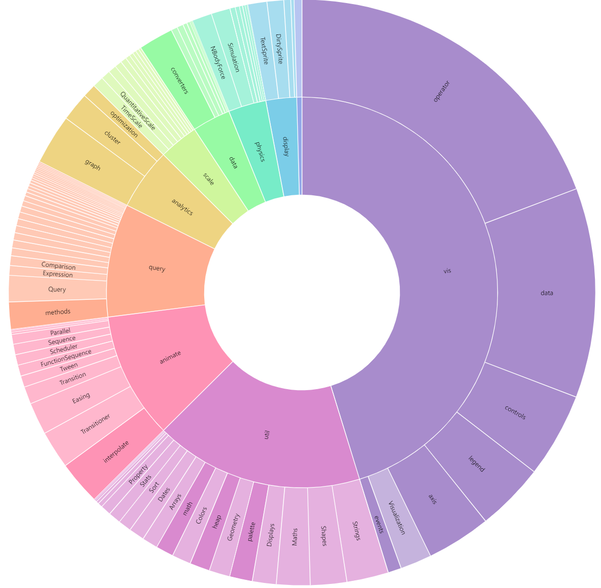

# D3.js

## Introduction 

`d3.js` is a JavaScript library for data visualization. 

## Tutorial & Examples 

### Use Observable 

Numerous examples are available in https://d3js.org/.

#### Observable to HTML + script conversion

The Observable code is wrapped within `chart` object to display in Observable platform. It can be converted into a function `drawChart(container, data)` and the `svg` creation part can be replaced by `select(container).append("svg")` and the data should be loaded and passed to `drawChart` function.

```
chart = {
    ...
    const svg = d3.create("svg")
      .attr("viewBox", [-width / 2, -height / 2, width, width])
      .style("font", "10px sans-serif");
    ...
}
```

```
<script>
function drawChart(container, data) {
    ...
    const svg = d3.select(container)
      .append("svg")
      .attr("viewBox", [-width / 2, -height / 2, width, width])
      .style("font", "10px sans-serif");
    ...

}
</script>
```

```
<body>
<div id='chart'></div>
    <script>
        function loadJson() {
            return fetch("./flare-2.json")
                .then(res => {
                    if (!res.ok) {
                        throw new Error('Network response error');
                    }
                    return res.json();
                });
        }

        loadJson()
            .then(data => {
                drawChart('#container', data);
                console.log(data);
            })
            .catch(error => {
                console.error('Error:', error);
            });
    </script>
</body>
```


#### Observable examples

| Example  | Figure                                         |
| -------- | ---------------------------------------------- |
| Sunburst |               |
|          | https://observablehq.com/@d3/zoomable-sunburst |


## Files 

| File         | Description       | Source                                                                                                                              |
| ------------ | ----------------- | ----------------------------------------------------------------------------------------------------------------------------------- |
| flare-2.json | Example data file | https://gist.githubusercontent.com/curran/d2656e98b489648ab3e2071479ced4b1/raw/9f2499d63e971c2110e52b3fa2066ebed234828c/flare-2.jso |
